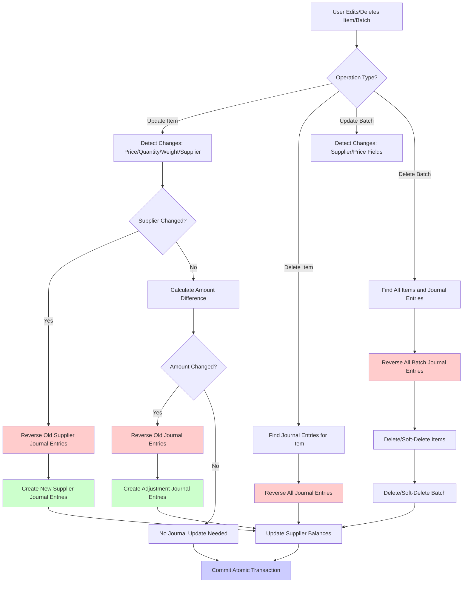

# Atomic Received Items Editing with Journal Entry Updates (Complete)

## Overview

When editing received items (inventory items), individual inventory items, or batch-level information, all changes must be atomic and properly reflected in journal entries. This ensures supplier account balances are always accurate and the accounting records remain consistent.

## Current State Analysis

### Existing Functionality

- **Journal entries** are created when inventory is received:
- Cash purchases: Debit Inventory (1300), Credit Cash (1100)
- Credit purchases: Debit Inventory (1300), Credit Accounts Payable (2100)
- **Price adjustments** exist in `inventoryPurchaseService.ts` but only for individual item price changes
- **Journal entries** have `bill_id` field to link them to `inventory_bills`
- **Reversal mechanism** exists: `reversal_of_journal_entry_id` and `entry_type: 'reversal'`
- **`updateInventoryItem`** handles price adjustments for cash purchases but doesn't handle supplier changes or quantity/weight changes
- **`deleteInventoryItem`** doesn't reverse journal entries

### Gaps

- `updateInventoryBatch` in [OfflineDataContext.tsx](apps/store-app/src/contexts/OfflineDataContext.tsx) doesn't update journal entries when supplier changes
- `updateInventoryItem` doesn't handle supplier changes or quantity/weight changes that affect journal entries
- `deleteInventoryItem` doesn't reverse journal entries when items are deleted
- Editing received items (inventory items) doesn't trigger journal entry updates
- No atomic transaction wrapping for batch edits that affect journal entries
- No batch deletion functionality with journal entry reversals

## Implementation Plan

### 1. Create Journal Entry Update Service

**File**: `apps/store-app/src/services/receivedItemsJournalService.ts` (new)Create a new service to handle journal entry updates for received items:

- `reverseJournalEntriesForBatch(batchId, reason)` - Find and reverse all journal entries linked to a batch
- `reverseJournalEntriesForItem(itemId, reason)` - Find and reverse journal entries linked to an inventory item
- `createJournalEntriesForBatch(batchId, supplierId, items, currency)` - Create new journal entries for updated batch
- `createJournalEntriesForItem(itemId, supplierId, amount, currency, batchId)` - Create journal entries for individual item
- `updateJournalEntriesForItemEdit(itemId, oldData, newData)` - Handle individual item edits
- `updateJournalEntriesForSupplierChange(batchId, oldSupplierId, newSupplierId, items)` - Handle supplier changes
- `findJournalEntriesForBatch(batchId)` - Find all journal entries linked to a batch via bill_id
- `findJournalEntriesForItem(itemId, batchId)` - Find journal entries for a specific item

### 2. Enhance `updateInventoryBatch` Function

**File**: [apps/store-app/src/contexts/OfflineDataContext.tsx](apps/store-app/src/contexts/OfflineDataContext.tsx) (line ~5498)Wrap the update in an atomic transaction that:

1. Detects if `supplier_id` changed
2. If supplier changed:

- Find all inventory items in the batch
- Calculate total amounts for old supplier
- Reverse all journal entries for old supplier (using reversal mechanism)
- Create new journal entries for new supplier with same amounts

3. If price-related fields changed (but supplier didn't):

- Find related journal entries
- Calculate difference in amounts
- Create adjustment journal entries (similar to existing price adjustment logic)

4. Ensure all operations are atomic within a single IndexedDB transaction

### 3. Enhance `updateInventoryItem` Function

**File**: [apps/store-app/src/contexts/OfflineDataContext.tsx](apps/store-app/src/contexts/OfflineDataContext.tsx) (line ~4444)Enhance to handle all changes that affect journal entries:

1. Detect changes to:

- Price (`price`)
- Quantity (`quantity`)
- Weight (`weight`)
- Supplier (if items can have individual suppliers, via batch)

2. Calculate old vs new total amounts:

- Old: `(oldQuantity || oldWeight) * oldPrice`
- New: `(newQuantity || newWeight) * newPrice`

3. If batch exists and amount changed:

- Find related journal entries via batch
- Reverse old journal entries
- Create new journal entries with updated amounts

4. If supplier changed (via batch update):

- Reverse old supplier's journal entries
- Create new supplier's journal entries

5. Wrap in atomic transaction with journal entry operations

### 4. Enhance `deleteInventoryItem` Function

**File**: [apps/store-app/src/contexts/OfflineDataContext.tsx](apps/store-app/src/contexts/OfflineDataContext.tsx) (line ~4612)Add journal entry reversal:

1. Before deleting/soft-deleting the item:

- Find all journal entries linked to the item (via batch_id)
- Calculate total amount that needs to be reversed
- Reverse all journal entries for this item
- Update supplier balances accordingly

2. Handle both hard delete and soft delete scenarios
3. Ensure atomicity with item deletion

### 5. Add Batch Deletion Functionality

**File**: [apps/store-app/src/contexts/OfflineDataContext.tsx](apps/store-app/src/contexts/OfflineDataContext.tsx) (new function)Create `deleteInventoryBatch` function:

1. Find all inventory items in the batch
2. Find all journal entries linked to the batch
3. Reverse all journal entries atomically
4. Delete or soft-delete all items in the batch
5. Delete or soft-delete the batch itself
6. Update supplier balances
7. Wrap everything in a single atomic transaction

### 6. Enhance `updateSale` for Received Items

**File**: [apps/store-app/src/contexts/OfflineDataContext.tsx](apps/store-app/src/contexts/OfflineDataContext.tsx) (line ~5124)When editing received items (inventory items), not just sold items:

1. Check if item is part of a received batch (has `batch_id`)
2. If price/quantity/weight changed:

- Find related journal entries via batch
- Calculate old vs new total amounts
- Reverse old journal entries
- Create new journal entries with updated amounts

3. If supplier changed at item level:

- Reverse old supplier's journal entries
- Create new supplier's journal entries

### 7. Link Journal Entries to Batches

**File**: [apps/store-app/src/services/inventoryPurchaseService.ts](apps/store-app/src/services/inventoryPurchaseService.ts)Ensure journal entries created during inventory receiving include `bill_id` field pointing to `inventory_bills.id`:

- Update `processCashPurchase` to set `bill_id` in journal entries
- Update `processCreditPurchase` to set `bill_id` in journal entries
- Use batch ID as the `bill_id` reference

### 8. Atomic Transaction Wrapper

**File**: [apps/store-app/src/contexts/OfflineDataContext.tsx](apps/store-app/src/contexts/OfflineDataContext.tsx)Create wrapper functions that ensure atomicity:

- `updateReceivedItemsAtomically` - Wraps all updates in a single IndexedDB transaction
- `deleteReceivedItemsAtomically` - Wraps deletions with journal entry reversals
- Includes: `inventory_items`, `inventory_bills`, `journal_entries`, `transactions`, `entities`
- Ensures all-or-nothing behavior
- Handles rollback on errors

### 9. Update UI Components

**Files**:

- [apps/store-app/src/pages/Inventory.tsx](apps/store-app/src/pages/Inventory.tsx)
- [apps/store-app/src/components/accountingPage/tabs/ReceivedBills.tsx](apps/store-app/src/components/accountingPage/tabs/ReceivedBills.tsx)
- [apps/store-app/src/components/accountingPage/tabs/SoldBills.tsx](apps/store-app/src/components/accountingPage/tabs/SoldBills.tsx)

Ensure UI calls the atomic update functions:

- Batch edits should call enhanced `updateInventoryBatch`
- Item edits in Inventory.tsx should call enhanced `updateInventoryItem`
- Item deletions should call enhanced `deleteInventoryItem`
- Add batch deletion UI if needed

## Data Flow




## Key Implementation Details

### Journal Entry Reversal Pattern

```typescript
// Find original entries
const originalEntries = await getDB().journal_entries
  .where('bill_id').equals(batchId)
  .and(e => e.entity_id === oldSupplierId && e.entry_type !== 'reversal')
  .toArray();

// Create reversal entries (swap debit/credit)
for (const entry of originalEntries) {
  const reversalEntry = {
    ...entry,
    id: createId(),
    transaction_id: createId(),
    debit_usd: entry.credit_usd,
    credit_usd: entry.debit_usd,
    debit_lbp: entry.credit_lbp,
    credit_lbp: entry.debit_lbp,
    entry_type: 'reversal',
    reversal_of_journal_entry_id: entry.id,
    description: `Reversal: ${entry.description}`
  };
}
```


### Amount Calculation

- For inventory items: `totalAmount = (quantity || weight) * price`
- For batches: Sum of all items in batch
- Handle currency conversion (USD/LBP) correctly
- Consider both quantity and weight (use weight if available, otherwise quantity)

### Supplier Balance Updates

- Balances are calculated from journal entries (not manually updated)
- Ensure journal entries use correct `entity_id` for supplier
- Account code 2100 (Accounts Payable) for supplier balances
- Account code 1300 (Inventory) for inventory asset

### Atomic Transaction Scope

All operations must be wrapped in IndexedDB transactions including:

- `inventory_items` table updates/deletes
- `inventory_bills` table updates/deletes
- `journal_entries` table inserts (reversals and new entries)
- `transactions` table inserts (for audit trail)
- `entities` table (if balance updates needed)

## Testing Considerations

1. **Test inventory item update**: Change price/quantity/weight, verify journal entries updated
2. **Test inventory item delete**: Delete item, verify journal entries reversed
3. **Test supplier change on batch**: Change supplier, verify old entries reversed and new ones created
4. **Test supplier change on item**: Change supplier via batch, verify journal entries updated
5. **Test price change**: Change price, verify adjustment entries created
6. **Test quantity change**: Change quantity, verify journal entries updated
7. **Test batch deletion**: Delete batch, verify all journal entries reversed
8. **Test atomicity**: Simulate error mid-update, verify rollback
9. **Test multiple edits**: Edit batch then edit items, verify consistency
10. **Test currency handling**: Ensure USD/LBP conversions are correct

## Files to Modify

1. `apps/store-app/src/services/receivedItemsJournalService.ts` (new)
2. `apps/store-app/src/contexts/OfflineDataContext.tsx` 

- `updateInventoryBatch` (enhance)
- `updateInventoryItem` (enhance)
- `deleteInventoryItem` (enhance)
- `deleteInventoryBatch` (new)
- `updateSale` (enhance for received items)

3. `apps/store-app/src/services/inventoryPurchaseService.ts` (ensure bill_id linking)
4. `apps/store-app/src/pages/Inventory.tsx` (UI integration)
5. `apps/store-app/src/components/accountingPage/tabs/ReceivedBills.tsx` (UI integration)
6. `apps/store-app/src/components/accountingPage/tabs/SoldBills.tsx` (UI integration if needed)

## Dependencies

- Existing journal entry reversal mechanism