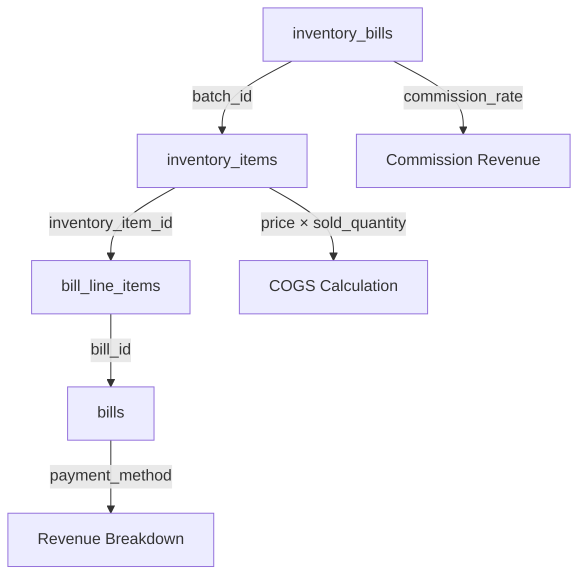

---name: Profit Loss Implementationoverview: Implement a comprehensive Profit & Loss (P&L) reporting system that calculates gross profit for each bill based on purchase type (commission, cash, credit), with filtering by branch, date range (daily/monthly/yearly), product category, and sale payment method (cash/card/credit). Note: Purchase type (how inventory was acquired) is separate from sale payment method (how customers paid for sales).todos:

- id: create-pl-types

content: Create profit loss type definitions in apps/store-app/src/types/profitLoss.tsstatus: pending

- id: update-db-schema

content: Add P&L fields (total_revenue, revenue_cash, revenue_card, revenue_credit, total_cogs, gross_profit, gross_profit_margin) to inventory_bills table schema in types/index.ts and db.tsstatus: pendingdependencies:

    - create-pl-types
- id: create-pl-service

content: "Create profitLossService.ts with calculateBillPL (commission: revenue=commission only, COGS=0; cash/credit: revenue=total sales, COGS=inventory cost + fees), storeBillPL, and generatePLReport methods"status: pendingdependencies:

    - update-db-schema
- id: integrate-bill-closure

content: Integrate P&L calculation into handleCloseReceivedBill in Accounting.tsx to calculate and store P&L when bill is closedstatus: pendingdependencies:

    - create-pl-service
- id: create-pl-hook

content: Create useProfitLoss.ts React hook for fetching and filtering P&L data (only from closed bills with stored values)status: pendingdependencies:

    - integrate-bill-closure
- id: create-pl-component

content: Create ProfitLossReport.tsx component with filters, summary cards, and data tablestatus: pendingdependencies:

    - create-pl-hook
- id: integrate-reports-page

content: Implement profit report case in Reports.tsx page (reportType === profit)status: pendingdependencies:

    - create-pl-component
- id: add-currency-handling

content: Integrate currency service for USD/LBP conversions in P&L calculationsstatus: pendingdependencies:

    - create-pl-service
- id: test-bill-types

content: "Test P&L calculations for all three bill types (commission: revenue=commission, COGS=0; cash/credit: revenue=sales, COGS=cost+fees) at bill closure and verify values are stored correctly"status: pendingdependencies:

    - integrate-bill-closure
- id: add-export-functionality

content: Add CSV/Excel export functionality to ProfitLossReport componentstatus: pendingdependencies:

    - create-pl-component

---

# Profit & Loss (P&L) I

mplementation Plan

## Overview

Implement a comprehensive P&L reporting system that calculates gross profit for each bill **when the bill is closed** (not on every sale). P&L values are stored in the `inventory_bills` table and remain immutable once calculated. Reports use stored values, not recalculated values.

## Business Logic - P&L Calculations by Bill Type

**Important Terminology:**

- **Purchase Type** (billType): commission/cash/credit - how inventory was acquired from supplier
- **Sale Payment Method** (paymentMethod): cash/card/credit - how customers paid for sales
- These are separate concepts and should not be confused in the implementation

### Commission Purchase Bills

- **Revenue**: Commission earned only = `(commission_rate × total_sales) / 100`
- Example: 10% of $464 = $46.40
- **COGS**: 0 (goods are not owned by the store)
- **Gross Profit**: Equal to revenue (since COGS = 0)
- **Fees**: Porterage + Transfer + Plastic fees are **recoverable from supplier**, not costs
- **Supplier Payable**: Total sales - Commission - Fees (recorded separately, not part of P&L)

### Cash Purchase Bills

- **Revenue**: Total sales value = Sum of `line_total` from all `bill_line_items` for sold items
- Revenue is recognized at sale, not at collection. Collections are handled separately in payments/receipts.
- **COGS**: `(inventory_item.price × sold_quantity) + fees`
- Fees: Porterage + Transfer + Plastic
- **Gross Profit**: Revenue - COGS

### Credit Purchase Bills

- **Revenue**: Total sales value = Sum of `line_total` from all `bill_line_items` for sold items
- Revenue is recognized at sale, not at collection. Collections are handled separately in payments/receipts.
- **COGS**: `(inventory_item.price × sold_quantity) + fees`
- Fees: Porterage + Transfer + Plastic
- **Gross Profit**: Revenue - COGS
- **Supplier Payable**: Inventory cost (recorded separately, not part of P&L)

## Architecture

### Data Flow




### Key Calculations (Performed at Bill Closure)

1. **Revenue Calculation**:

- **Commission bills**: `(commission_rate × total_sales) / 100`
- Where total_sales = sum of `line_total` from all `bill_line_items` for sold items
- **Cash/Credit bills**: Total sales value = Sum of `line_total` from `bill_line_items` for sold items
- Revenue is recognized at sale, not at collection. Collections are handled separately in payments/receipts.

2. **Revenue Breakdown by Sale Payment Method**:

- **Important**: Distinguish between:
- **Purchase Type** (billType): commission/cash/credit - how inventory was acquired
- **Sale Payment Method** (paymentMethod): cash/card/credit - how customers paid for sales
- Get `bills` linked to `bill_line_items` to determine `payment_method` (sale payment method)
- Group revenue by sale payment method (cash, card, credit)
- For commission bills, breakdown is based on commission portion of each sale

3. **COGS Calculation**:

- **Commission bills**: 0 (goods not owned, fees recoverable)
- **Cash/Credit bills**: `sum(inventory_item.price × sold_quantity) + fees`
    - Fees = porterage_fee + transfer_fee + plastic_fee

4. **Gross Profit**: Revenue - COGS
5. **Gross Profit Margin**: `(Gross Profit / Revenue) × 100` (handle division by zero for commission bills with 0 revenue)

### Storage Strategy

- P&L values are calculated **once** when `handleCloseReceivedBill` is called
- Values are stored in `inventory_bills` table as new fields:
- `total_revenue` (number): Revenue for the bill
- `revenue_cash` (number): Revenue from cash sales
- `revenue_card` (number): Revenue from card sales
- `revenue_credit` (number): Revenue from credit sales
- `total_cogs` (number): Total cost of goods sold (0 for commission bills)
- `gross_profit` (number): Revenue - COGS
- `gross_profit_margin` (number): Profit margin percentage
- Once stored, these values are **immutable** and used for all reports
- Only closed bills (`status = 'CLOSED'` and `closed_at IS NOT NULL`) have P&L values

## Implementation Steps

### Phase 1: Database Schema Update

**Update `inventory_bills` table** to store P&L values:Add new fields to `apps/store-app/src/types/index.ts`:

- `total_revenue?: number | null` - Revenue for the bill
- `revenue_cash?: number | null` - Revenue from cash sales
- `revenue_card?: number | null` - Revenue from card sales
- `revenue_credit?: number | null` - Revenue from credit sales
- `total_cogs?: number | null` - Total cost of goods sold (0 for commission bills)
- `gross_profit?: number | null` - Gross profit (revenue - COGS)
- `gross_profit_margin?: number | null` - Profit margin percentage

**Migration**: Add these fields to IndexedDB schema in `apps/store-app/src/lib/db.ts`

### Phase 2: Core P&L Service (`profitLossService.ts`)

Create `apps/store-app/src/services/profitLossService.ts` with:

1. **Bill P&L Calculator** (Called at bill closure)

- `calculateBillPL(billId)`: Calculate and return P&L for a bill
- Get all inventory items for the bill (via `batch_id`)
- Get all sales (bill_line_items) linked to those inventory items
- Calculate total sales: Sum of `line_total` from all sales
- Calculate revenue based on purchase type (billType):
    - **Commission**: `(bill.commission_rate × total_sales) / 100`
    - Where total_sales = sum of `line_total` from all `bill_line_items` for sold items
    - **Cash/Credit**: Total sales value = sum of `line_total` from `bill_line_items` for sold items
    - Revenue is recognized at sale, not at collection
- Calculate revenue breakdown by sale payment method:
    - **Important**: Separate purchase_type (how inventory was acquired) from sale_payment_method (how customers paid)
    - Get `bills` linked to `bill_line_items` to determine `payment_method` (sale payment method)
    - Group revenue by sale payment method (cash, card, credit)
    - For commission bills, breakdown is based on commission portion of each sale
- Calculate COGS based on bill type:
    - **Commission**: 0 (goods not owned, fees recoverable)
    - **Cash/Credit**: `sum(inventory_item.price × sold_quantity) + fees`
    - Fees = porterage_fee + transfer_fee + plastic_fee
- Calculate gross profit and margin
- Returns: `{ revenue, revenueCash, revenueCard, revenueCredit, cogs, grossProfit, grossProfitMargin }`

2. **P&L Storage** (Called from bill closure handler)

- `storeBillPL(billId, plData)`: Store calculated P&L values in `inventory_bills`
- Updates: `total_revenue`, `revenue_cash`, `revenue_card`, `revenue_credit`, `total_cogs`, `gross_profit`, `gross_profit_margin`
- Only stores if bill is being closed (status = 'CLOSED')
- Prevents overwriting if values already exist (immutability)

3. **P&L Report Generator** (Uses stored values)

- `generatePLReport(filters)`: Main report generation method
- **Only queries closed bills** (`status = 'CLOSED'` and `closed_at IS NOT NULL`)
- **Uses stored P&L values** from `inventory_bills` table (no recalculation)
- Filters: `branchId`, `startDate`, `endDate`, `billType[]`, `productCategory[]`, `paymentMethod[]`
- **billType[]**: Filter by purchase type (commission/cash/credit) - how inventory was acquired
- **paymentMethod[]**: Filter by sale payment method (cash/card/credit) - how customers paid for sales
- Sale payment method filter: Filter bills where revenue from that sale payment method > 0
- Date filtering uses `closed_at` timestamp (when bill was closed)
- Returns: Aggregated P&L data with breakdowns

4. **Aggregation Methods**

- `aggregateByBillType()`: Group by purchase type (commission/cash/credit) - how inventory was acquired
- `aggregateByProductCategory()`: Group by product category (from products table)
- `aggregateByPaymentMethod()`: Group by sale payment method (cash/card/credit) - how customers paid for sales, using stored revenue breakdown
- `aggregateByDateRange()`: Daily/monthly/yearly breakdowns based on `closed_at`

### Phase 3: Integration with Bill Closure

**Modify `apps/store-app/src/pages/Accounting.tsx`** - `handleCloseReceivedBill` function:

1. After calculating fees (lines 804-903), call P&L calculation:
```typescript
const plData = await profitLossService.calculateBillPL(targetBatchId);
await profitLossService.storeBillPL(targetBatchId, plData);
```


2. Store P&L values along with commission_amount and closed_at:
```typescript
await handleUpdateBatch(targetBatchId, { 
  status: closedStatus,
  commission_amount: fees.commission,
  closed_at: new Date().toISOString(),
  total_revenue: plData.revenue,
  revenue_cash: plData.revenueCash,
  revenue_card: plData.revenueCard,
  revenue_credit: plData.revenueCredit,
  total_cogs: plData.cogs,
  gross_profit: plData.grossProfit,
  gross_profit_margin: plData.grossProfitMargin
});
```


**Important**: Ensure P&L is only calculated once when bill is closed, never recalculated.

### Phase 4: Data Models & Types

Create `apps/store-app/src/types/profitLoss.ts`:

```typescript
export interface PLReportFilters {
  storeId: string;
  branchId?: string;
  startDate: string;
  endDate: string;
  billTypes?: ('commission' | 'cash' | 'credit')[]; // Purchase type: how inventory was acquired
  productCategories?: string[];
  paymentMethods?: ('cash' | 'card' | 'credit')[]; // Sale payment method: how customers paid for sales
  groupBy?: 'bill' | 'product' | 'category' | 'date';
}

export interface PLReportLine {
  billId: string;
  billNumber?: string;
  billType: 'commission' | 'cash' | 'credit';
  closedAt: string; // When bill was closed (used for date filtering)
  receivedAt: string; // When bill was received
  revenue: number; // From stored total_revenue
  revenueCash?: number; // From stored revenue_cash (sale payment method: cash)
  revenueCard?: number; // From stored revenue_card (sale payment method: card)
  revenueCredit?: number; // From stored revenue_credit (sale payment method: credit)
  cogs: number; // From stored total_cogs (0 for commission bills)
  grossProfit: number; // From stored gross_profit
  grossProfitMargin: number; // From stored gross_profit_margin
  productCategory?: string; // From products table
  supplierName?: string;
}

export interface PLReportSummary {
  totalRevenue: number;
  totalCOGS: number;
  totalGrossProfit: number;
  averageGrossProfitMargin: number;
  billCount: number;
  lines: PLReportLine[];
  breakdowns: {
    byBillType: Record<string, PLReportSummary>;
    byProductCategory: Record<string, PLReportSummary>;
    byPaymentMethod: Record<string, PLReportSummary>; // Grouped by sale payment method (cash/card/credit)
    byDateRange: Record<string, PLReportSummary>;
  };
}
```


### Phase 5: UI Components

1. **ProfitLossReport Component** (`apps/store-app/src/components/reports/ProfitLossReport.tsx`)

- Filter controls:
- Branch, date range
- Purchase type (billType): commission/cash/credit - how inventory was acquired
- Product category
- Sale payment method (paymentMethod): cash/card/credit - how customers paid for sales
- Show revenue breakdown by sale payment method (cash/card/credit) for each bill
- Date range presets (Today, This Week, This Month, This Year, Custom)
- Summary cards (Total Revenue, Total COGS, Gross Profit, Margin %)
- Data table with sortable columns
- Export functionality (CSV/Excel)

2. **Update Reports Page** (`apps/store-app/src/pages/Reports.tsx`)

- Implement the missing `reportType === 'profit'` case
- Integrate `ProfitLossReport` component

3. **P&L Dashboard Widget** (Optional)

- Add to Accounting dashboard
- Show key metrics (Gross Profit, Margin %)
- Quick date range selector

### Phase 6: Integration Points

1. **Link Inventory Items to Bills**

- Ensure `bill_line_items.inventory_item_id` properly links to `inventory_items`
- Verify `inventory_items.batch_id` links to `inventory_bills`
- Handle edge cases (deleted items, missing links)

2. **Cost Calculation Logic** (At bill closure)

- **Commission bills**: COGS = 0 (fees are recoverable, not costs)
- **Cash/Credit bills**: COGS = `sum(inventory_item.price × sold_quantity) + fees`
- Handle currency conversions (USD/LBP) using existing `currencyService`
- Calculate based on actual sold quantities (not received quantities)

3. **Date Range Handling**

- Daily: Group by `closed_at` date (when bill was closed)
- Monthly: Group by year-month of `closed_at`
- Yearly: Group by year of `closed_at`
- Filter bills where `closed_at` is within date range

### Phase 7: Performance Optimization

1. **IndexedDB Queries**

- Use compound indexes for common queries
- Cache frequently accessed data
- Batch queries where possible

2. **Lazy Loading**

- Load summary first, details on demand
- Paginate large result sets
- Virtual scrolling for tables

## Existing Code to Leverage

1. **Bill Type Logic**: `apps/store-app/src/services/inventoryPurchaseService.ts`

- Already handles commission/cash/credit types
- Fee calculation logic exists

2. **Commission Calculation**: `apps/store-app/src/components/accountingPage/tabs/receivedBills/ReceivedBillSalesLogsModal.tsx` (lines 148-151)

- Has commission calculation: `(totalRevenue * commissionRate) / 100`

3. **Currency Service**: `apps/store-app/src/services/currencyService.ts`

- Use for currency conversions

4. **Reporting Service**: `apps/store-app/src/services/reportingService.ts`

- Can extend with P&L methods
- Or create separate service for clarity

## Files to Create/Modify

### New Files

- `apps/store-app/src/services/profitLossService.ts` - Core P&L calculation service
- `apps/store-app/src/types/profitLoss.ts` - Type definitions
- `apps/store-app/src/components/reports/ProfitLossReport.tsx` - Main UI component
- `apps/store-app/src/hooks/useProfitLoss.ts` - React hook for P&L data

### Files to Modify

- `apps/store-app/src/pages/Accounting.tsx` - Integrate P&L calculation at bill closure
- `apps/store-app/src/pages/Reports.tsx` - Add profit report implementation
- `apps/store-app/src/types/index.ts` - Add P&L fields to inventory_bills interface
- `apps/store-app/src/lib/db.ts` - Add P&L fields to IndexedDB schemawork

## Testing Considerations

1. **Unit Tests**: Test P&L calculation for each purchase type at closure

- Commission: Revenue = commission (from total sales value), COGS = 0
- Cash: Revenue = total sales value (sum of line_total), COGS = inventory cost + fees
- Credit: Revenue = total sales value (sum of line_total), COGS = inventory cost + fees

2. **Integration Tests**: Test bill closure flow with P&L calculation and storage
3. **Report Tests**: Test report generation using stored values with various filters
4. **Edge Cases**:

- Missing inventory items
- Deleted bills