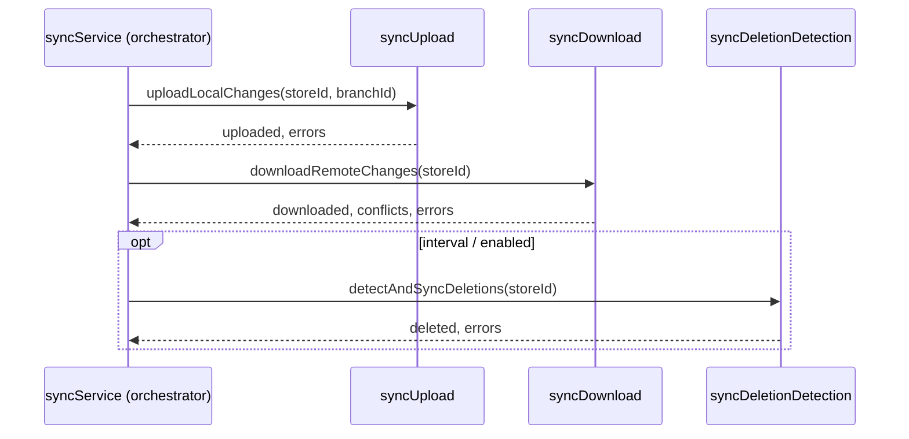

# Data model (conceptual): Sync modules

This feature does **not** change Dexie or Supabase schemas. This document describes **logical modules** and **data flow** for the refactor.

## Orchestration sequence (unchanged)

## Module responsibilities

| Module | Owns | Reads | Writes |
|--------|------|-------|--------|
| **syncConfig** | Constants, table order, dependency map, `SyncResult` shape | — | — |
| **syncUpload** | Batching unsynced rows, dependency order, validation, `eventEmissionService` after confirmed upload | Dexie, Supabase | Supabase inserts/updates, local `_synced`, events via RPC |
| **syncDownload** | Per-table remote fetch, incremental vs full, conflict counting, local upsert | Supabase, Dexie | Local tables |
| **syncDeletionDetection** | Remote ID scans vs local, hash/count shortcuts, pagination for large tables | Supabase, Dexie | Local deletes / `_deleted` |
| **syncService (orchestrator)** | `sync()`, `fullResync()`, `syncTable()`, `syncStoresAndBranches()`, reentrancy guard, composing results | Calls modules | — |

## Instance state (orchestrator)

Stays on `SyncService` unless a strong reason exists to extract:

- `isRunning` — concurrent sync guard  
- `deletionStateCache` — `Map` for incremental deletion checks  
- `lastDeletionCheck` / timing — `SYNC_CONFIG.deletionDetectionInterval`  
- Last sync attempt timestamps (existing behavior)  

## Key entities (from spec)

Mapped to code:

| Spec entity | Location after split |
|-------------|---------------------|
| Sync configuration | `syncConfig.ts` |
| Local pending change | Read/write Dexie in upload (and download merge) |
| Remote row snapshot | Download + deletion remote queries |
| Deletion candidate | Deletion detection comparison results |
